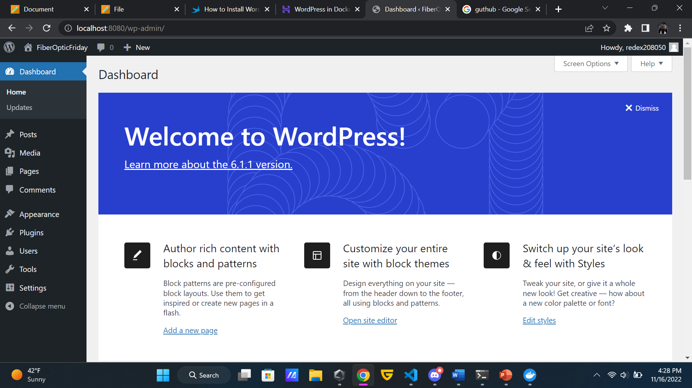

# **Docker Installation For Windows**

## ***-Install and setup WSL-***
(1.) *Open an administrative console*

(2.) *Download WSL*
```powershell
> wsl --install
```

(3.) *Reboot after installation*

(4.) *Enter a username and password in the Ubuntu terminal*

(5.) *Update and upgrade packages*
```sh
$ sudo apt update && sudo apt upgrade
```

## ***-Install Docker-***
(1.) Download "Docker Desktop for Windows" \
Link->[Docker Installer](https://docs.docker.com/desktop/install/windows-install/)

(2.) Run Docker Desktop Installer.exe


*Links used*
- https://docs.docker.com/desktop/install/windows-install/
- https://learn.microsoft.com/en-us/windows/wsl/install
- https://learn.microsoft.com/en-us/windows/wsl/setup/environment#set-up-your-linux-username-and-password


# **Wordpress Installation**

(1.) *Create wordpress directory*
```sh
$ sudo mkdir -p /srv/wordpress
```

(2.) *Create YAML file in wordpress directory and add the write the following in it*
```sh
$ sudo nano /srv/wordpress/docker-compose.yaml
```
    version: '3'
    services:
    mysql:
        image: mysql:latest
        restart: always
        environment:
        MYSQL_ROOT_PASSWORD: my_password
        MYSQL_DATABASE: wordpress
        MYSQL_USER: wordpress_user
        MYSQL_PASSWORD: wordpress_password
        volumes:
        - mysql_data:/var/lib/mysql
    wordpress:
        image: wordpress:latest
        depends_on:
        - mysql
        ports:
        - 8080:80
        restart: always
        environment:
        WORDPRESS_DB_HOST: mysql:3306
        WORDPRESS_DB_USER: wordpress_user
        WORDPRESS_DB_PASSWORD: wordpress_password
        volumes:
        - ./wp-content:/var/www/html/wp-content
    volumes:
    mysql_data:

(3.) *Build local environment*
```sh
$ cd /srv/wordpress

$ sudo docker-compose up -d
```

(4.) *Run container*

(5.) *Enter "https://localhost:8080" into your webrowsers url*
 


*Links used*
- https://linuxiac.com/wordpress-with-docker/


# **Failed Docker Installation Attempt on Ubuntu**
## *Run the following commands*
(1.) *Update package index*
```sh
$ sudo apt update
```

(2.) *Make directory to add Docker's GPG key and add it*
```sh
$ sudo mkdir -p /etc/apt/keyrings

$ sudo apt install curl

$ curl -fsSL https://download.docker.com/linux/ubuntu gpg | sudo gpg --dearmor -o /etc/apt/keyrings/docker.gpg
```

(3.) *Setup repository*
```sh
$ echo "deb [arch=$(dpkg --print-architecture) signed-by=/etc/apt/keyrings/docker.gpg] https://download.docker.com/linux/ubuntu $(lsb_release -cs) stable" | sudo tee /etc/apt/sources.list.d/docker.list > /dev/null
```

(4.) *Install Docker engine*
```sh
$ sudo apt-get update

$ sudo apt-get install docker-ce docker-ce-cli containerd.io docker-compose-plugin
```

## *links used*
- https://docs.docker.com/engine/install/
- https://docs.docker.com/compose/install/ubuntu/
- https://docs.docker.com/engine/install/ubuntu/#install-from-a-package

# *I recieved an error so I tried Windows instead*


# **Wasted time**
(1.) *Clone Repository*
```sh
$ git clone https://github.com/isaudits/docker-gvm
```

(2.) *Create a copy of the environmental variables file*
```sh
$ cp docker-gvm/config/example.env docker-gvm/config/local.env
```

(3.) *Change password*
```sh
$ nano docker-gvm/config/local.env
```

(4.) *Define Container*
```sh
$ sudo docker-compose up -d
```

(5.) **

*Links used*
- https://medium.com/@lam_1535/openvas-docker-compose-d6f50d9b1075
- https://sourceforge.net/projects/vcxsrv/