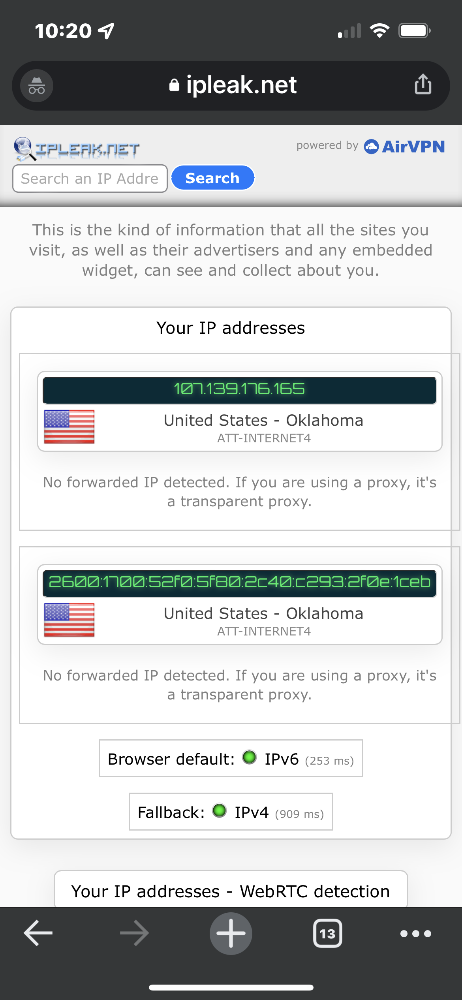
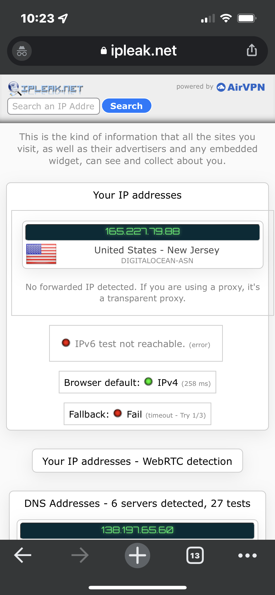
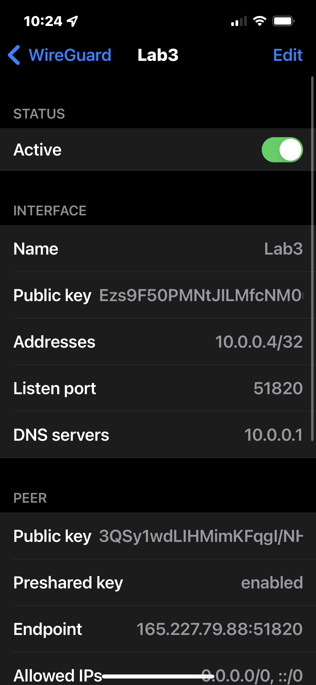
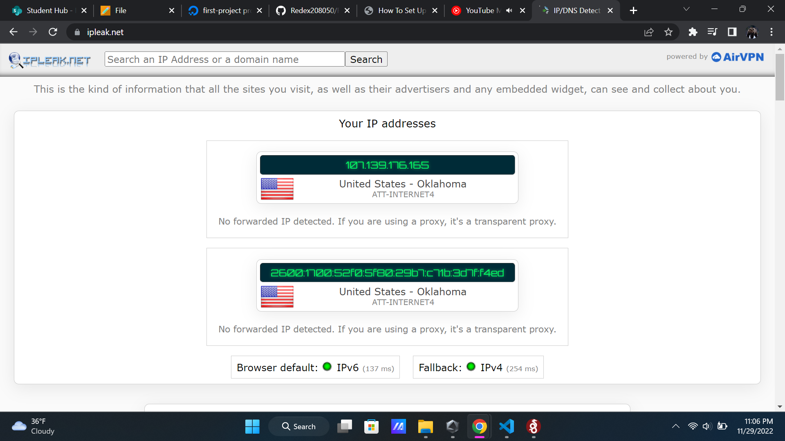
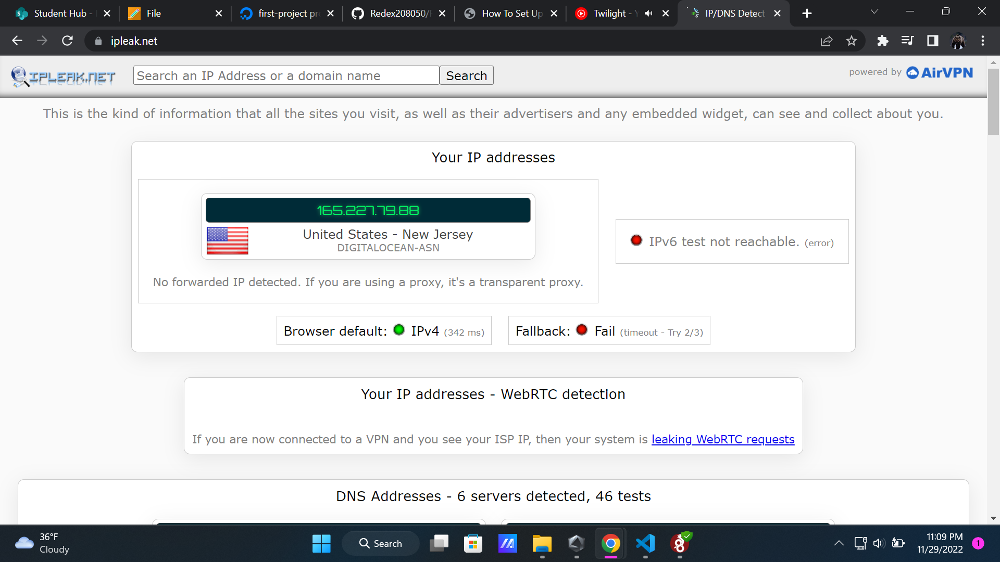
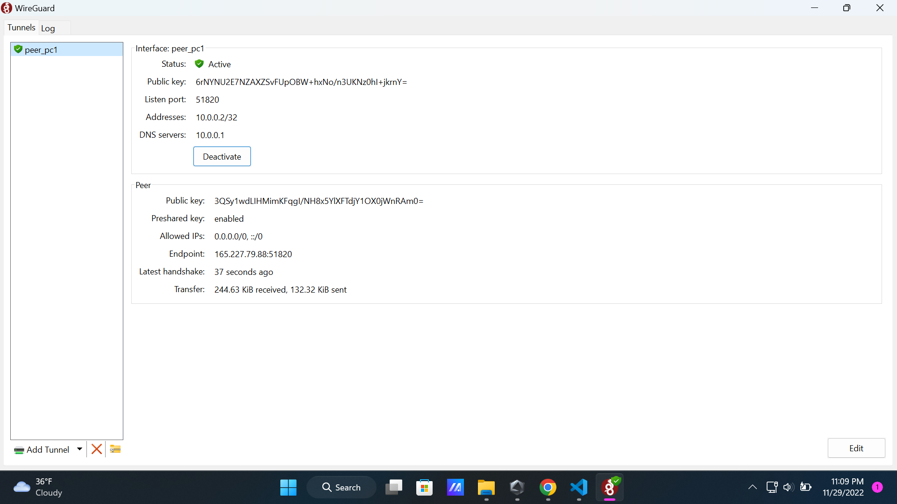

## ***How To Set Up Wireguard Using Docker***

# ***Create a Droplet***

1. **Create a DigitalOcean account or login with an existing account**

2. **When on the welcome screen, click the DigitalOcean logo to go to your dashboard**

3. **From the dashboard, select your project and select "Get started with a Droplet"**

4. **Configure Droplet:**
- *Change the version of Ubuntu to "20.04 (LTS) x64"*
- *Change the CPU option to "Regular with SSD"*
- *Choose "New York" as the datacenter region used*
- *Create password (used Version2000SysAdminBot)*
- ***Create Droplet or refer to Optional configuration***

***Optional:*** 
- *Change hostname to "Wireguard-Lab"*

# ***Download Docker***

1. **Launch the console for your new Droplet**

1. **Download Docker & Docker Compose**
- *Install required tools*
```sh
# sudo apt install apt-transport-https ca-certificates curl software-properties-common -y
```
- *Add Docker key*
```sh
# curl -fsSL https://download.docker.com/linux/ubuntu/gpg | sudo apt-key add -
```
- *Add Docker repository*
```sh
# sudo add-apt-repository \
   "deb [arch=amd64] https://download.docker.com/linux/ubuntu \
   $(lsb_release -cs) \
   stable"
```
- *Switch to the Docker repository*
```sh
# apt-cache policy docker-ce
```
- *Install Docker*
```sh
# sudo apt install docker-ce -y
```
- *Install Docker Compose*
```sh
# sudo curl -L "https://github.com/docker/compose/releases/download/1.27.4/docker-compose-$(uname -s)-$(uname -m)" -o /usr/local/bin/docker-compose
```
- *Set execute permissions for docker-compose*
```sh
# sudo chmod +x /usr/local/bin/docker-compose
```

# ***Setup Wireguard***

1. **Make Wireguard directories**
```sh
# mkdir -p wireguard/config/
```
2. **Create .yml file for docker compose and add the following content**
- ***Command***
```sh
# nano wireguard/docker-compose.yml
```
- ***Content (IMPORTANT! Edit TZ to your timezone and SERVEURL to your Droplet server IP. Note that the spacing below is slightly incorrect, as "source:" & "target:" should be aligned with "type:" above them.)***

    version: '3.8'\
    services:\
    &ensp;&ensp;wireguard:\
    &ensp;&ensp;&ensp;&ensp;container_name: wireguard\
    &ensp;&ensp;&ensp;&ensp;image: linuxserver/wireguard\
    &ensp;&ensp;&ensp;&ensp;environment:\
    &ensp;&ensp;&ensp;&ensp;&ensp;&ensp;- PUID=1000\
    &ensp;&ensp;&ensp;&ensp;&ensp;&ensp;- PGID=1000\
    &ensp;&ensp;&ensp;&ensp;&ensp;&ensp;-TZ=America/Chicago\
    &ensp;&ensp;&ensp;&ensp;&ensp;&ensp;- SERVERURL=165.227.79.88\
    &ensp;&ensp;&ensp;&ensp;&ensp;&ensp;- SERVERPORT=51820\
    &ensp;&ensp;&ensp;&ensp;&ensp;&ensp;- PEERS=pc1,pc2,phone1\
    &ensp;&ensp;&ensp;&ensp;&ensp;&ensp;- PEERDNS=auto\
    &ensp;&ensp;&ensp;&ensp;&ensp;&ensp;- INTERNAL_SUBNET=10.0.0.0\
    &ensp;&ensp;&ensp;&ensp;ports:\
    &ensp;&ensp;&ensp;&ensp;&ensp;&ensp;- 51820:51820/udp\
    &ensp;&ensp;&ensp;&ensp;volumes:\
    &ensp;&ensp;&ensp;&ensp;&ensp;&ensp;- type: bind\
    &ensp;&ensp;&ensp;&ensp;&ensp;&ensp;&ensp;&ensp;source: ./config/\
    &ensp;&ensp;&ensp;&ensp;&ensp;&ensp;&ensp;&ensp;target: /config/\
    &ensp;&ensp;&ensp;&ensp;&ensp;&ensp;- type: bind\
    &ensp;&ensp;&ensp;&ensp;&ensp;&ensp;&ensp;&ensp;source: /lib/modules\
    &ensp;&ensp;&ensp;&ensp;&ensp;&ensp;&ensp;&ensp;target: /lib/modules\
    &ensp;&ensp;&ensp;&ensp;restart: always\
    &ensp;&ensp;&ensp;&ensp;cap_add:\
    &ensp;&ensp;&ensp;&ensp;&ensp;&ensp;- NET_ADMIN\
    &ensp;&ensp;&ensp;&ensp;&ensp;&ensp;- SYS_MODULE\
    &ensp;&ensp;&ensp;&ensp;sysctls:\
    &ensp;&ensp;&ensp;&ensp;&ensp;&ensp;- net.ipv4.conf.all.src_valid_mark=1


3. **Enter the Wireguard directory and build Wireguard**

```sh
# cd wireguard

# docker-compose up -d
```

# ***Connect Mobile Device To WireGuard***

1. **Run command to get QR code from WireGuard logs**
```sh
# docker-compose logs -f wireguard
```

2. **Download the WireGuard app on your phone**

3. **Open the app and select "Add a Tunnel" then "Create from QR code"**

4. **Scan the "PEER phone1 QR code:" QR code and name the tunnel**

5. **Activate the tunnel by pressing the sliding button**

# ***Connect Windows Laptop to WireGuard***

1. **Download then run the WireGuard app on your Windows laptop by clicking [here](https://download.wireguard.com/windows-client/wireguard-installer.exe)**

2. **Exit out of WireGuard logs (Press ctrl+c)**

3. **Open the config for peer_pc1** 
```sh
# nano config/peer_pc1/peer_pc1.conf
```

4. **Create the file peer_pc1.conf anywhere on your laptop and copy the contents of the file from the Droplet into it**

5. **Add a tunnel in the WireGuard app on your laptop and select peer_pc1.conf**

6. **Activate the tunnel**

## **CONGRATULATIONS! You've completed this guide.**

## **Can't wait for Fiber Optic Friday!**

# **The Screenshots You Requested**

# **Original Phone IP**


# **Phone IP Using WireGuard**


# **Photo Evidence That The Tunnel Is Active On Phone**


# **Original Laptop IP**


# **Laptop IP Using WireGuard**


# **Photo Evidence That The Tunnel Is Active On Laptop**
